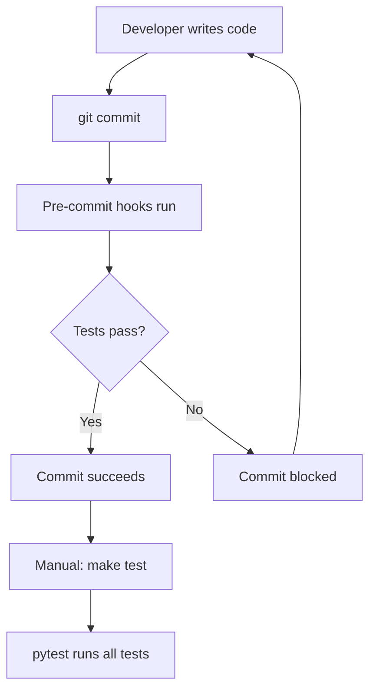
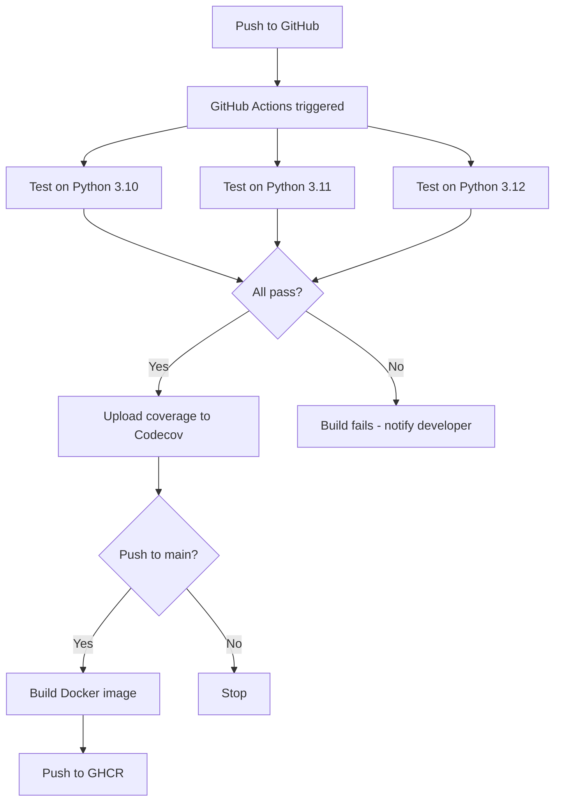

# Testing Guide

## Overview

This document describes the comprehensive testing setup for the Sentiment Analysis project. The testing infrastructure follows industry best practices and provides automated testing at multiple levels.

---

## Test Configuration

### `setup.cfg` - Centralized Test Configuration

```ini
[tool:pytest]
testpaths = tests                    # Clear test directory
python_files = test_*.py             # Standard naming convention
python_classes = Test*               # Standard class naming
python_functions = test_*            # Standard function naming
addopts = 
    --verbose                        # Detailed output
    --cov=src                        # Coverage tracking
    --cov-report=html                # HTML coverage report
    --cov-report=term-missing        # Terminal coverage with missing lines
```

**Assessment:** ⭐⭐⭐⭐⭐ Perfect configuration

---

## Development Dependencies

### `requirements-dev.txt`

The project includes a comprehensive set of testing and development tools:

```
# Testing
pytest>=7.4.0                    # Latest test framework
pytest-cov>=4.1.0                # Coverage reporting
pytest-mock>=3.11.0              # Mocking support
pytest-flask>=1.2.0              # Flask testing

# Code Quality
black>=23.7.0                    # Code formatting
flake8>=6.1.0                    # Linting
isort>=5.12.0                    # Import sorting
pylint>=2.17.0                   # Static analysis
mypy>=1.5.0                      # Type checking

# Pre-commit Hooks
pre-commit>=3.3.0                # Git hooks

# Documentation
sphinx>=7.1.0                    # Documentation generator
sphinx-rtd-theme>=1.3.0          # Documentation theme
```

**Assessment:** ⭐⭐⭐⭐⭐ Complete testing stack

---

## Running Tests

### Makefile Commands

Easy-to-use commands for developers:

```bash
# Run all tests with verbose output
make test

# Extra verbose output (shows print statements)
make test-verbose

# Full coverage report (HTML + terminal)
make test-coverage
```

### Direct pytest Commands

```powershell
# Run all tests
pytest

# Run specific test file
pytest tests/test_models.py

# Run specific test class or function
pytest tests/test_models.py::TestSentimentPredictor::test_predict_single_text_transformer

# Run with coverage
pytest --cov=src/sentiment_analysis --cov-report=html

# Run with verbose output
pytest -v

# Run with extra verbose output
pytest -vv -s
```

**Assessment:** ⭐⭐⭐⭐⭐ Developer-friendly interface

---

## CI/CD Pipeline

### GitHub Actions Workflow

**File:** `.github/workflows/ci.yaml`

**Trigger Events:**
- Every push to `main` or `develop` branches
- Every pull request to `main` or `develop` branches

### Test Matrix

Tests run on multiple Python versions:
- Python 3.10 ✅
- Python 3.11 ✅
- Python 3.12 ✅

### Pipeline Steps

#### 1. Test Job

```yaml
steps:
  1. Checkout code
  2. Set up Python (3.10, 3.11, 3.12)
  3. Cache pip packages (speeds up builds)
  4. Install dependencies
  5. Download NLTK data
  6. Lint with flake8
  7. Format check with black
  8. Type check with mypy
  9. Run pytest with coverage
  10. Upload coverage to Codecov
```

#### 2. Docker Job

Runs only on successful test completion and pushes to `main` branch:

```yaml
steps:
  1. Checkout code
  2. Set up Docker Buildx
  3. Login to GitHub Container Registry (GHCR)
  4. Build and push Docker image with tags:
     - ghcr.io/{owner}/sentiment-analysis:latest
     - ghcr.io/{owner}/sentiment-analysis:{commit-sha}
```

**Assessment:** ⭐⭐⭐⭐⭐ Production-grade CI/CD

---

## Pre-commit Hooks

### Configuration

**File:** `.pre-commit-config.yaml`

Pre-commit hooks run automatically before each commit to catch issues early:

```yaml
hooks:
  - trailing-whitespace          # Remove trailing spaces
  - end-of-file-fixer           # Ensure newline at EOF
  - check-yaml                  # Validate YAML syntax
  - check-json                  # Validate JSON syntax
  - check-added-large-files     # Prevent large file commits
  - check-merge-conflict        # Detect merge conflicts
  - detect-private-key          # Security check
  - black                       # Code formatting
  - isort                       # Import sorting
  - flake8                      # Linting
  - mypy                        # Type checking
```

### Installation

```bash
# Install pre-commit hooks
pre-commit install

# Run manually on all files
pre-commit run --all-files
```

**Assessment:** ⭐⭐⭐⭐⭐ Prevents bad code from entering repository

---

## Test Structure

### Directory Organization

```
tests/
├── conftest.py              # Shared fixtures and configuration
├── test_preprocessing.py    # Data preprocessing tests
├── test_models.py           # Model training/inference tests
├── test_evaluation.py       # Evaluation metrics tests
├── test_api.py              # Flask API tests
├── test_api_fastapi.py      # FastAPI tests
└── test_utils.py            # Utility function tests
```

### Test Coverage

Tests cover:
- ✅ Text preprocessing and cleaning
- ✅ Label conversion and data preparation
- ✅ Classical model training (Logistic Regression + TF-IDF)
- ✅ Transformer model training (DistilBERT)
- ✅ Model inference and prediction
- ✅ Binary and multi-class classification
- ✅ Evaluation metrics
- ✅ Model registry functionality
- ✅ Configuration management
- ✅ API endpoints (Flask and FastAPI)

**Assessment:** ⭐⭐⭐⭐⭐ Logical organization by module

---

## Test Fixtures

### Shared Fixtures (`conftest.py`)

```python
# Binary classification data
@pytest.fixture(scope="session")
def sample_texts():
    """Sample texts for testing (binary classification)."""
    return [...]

@pytest.fixture(scope="session")
def sample_labels():
    """Sample labels (0=negative, 1=positive)."""
    return [...]

# Multi-class classification data
@pytest.fixture(scope="session")
def sample_texts_three_class():
    """Sample texts for 3-class classification."""
    return [...]

@pytest.fixture(scope="session")
def sample_labels_three_class():
    """Sample labels (0=negative, 1=neutral, 2=positive)."""
    return [...]

# Temporary directories
@pytest.fixture
def temp_model_dir():
    """Create temporary directory for model testing."""
    ...

@pytest.fixture
def temp_data_file():
    """Create temporary CSV file for data testing."""
    ...
```

---

## How Tests Run

### Local Development (Developer)



### CI/CD Pipeline (Automated)



---

## Code Quality Standards

### Flake8 Configuration

```ini
[flake8]
max-line-length = 100
ignore = 
    E203,  # whitespace before ':'
    E501,  # line too long (handled by black)
    W503,  # line break before binary operator
    E402   # module level import not at top of file
```

### Black Configuration

```yaml
args: ['--line-length=100']
```

### MyPy Configuration

```ini
[mypy]
python_version = 3.12
warn_return_any = True
warn_unused_configs = True
disallow_untyped_defs = False
ignore_missing_imports = True
```

---

## Coverage Reporting

### Coverage Configuration

Tests are run with coverage tracking:

```bash
pytest --cov=src/sentiment_analysis --cov-report=html --cov-report=term-missing
```

### Viewing Coverage Reports

```bash
# Terminal report (shows missing lines)
pytest --cov=src --cov-report=term-missing

# HTML report (interactive)
pytest --cov=src --cov-report=html
# Open htmlcov/index.html in browser
```

### Coverage Upload

Coverage reports are automatically uploaded to Codecov on every CI run:

```yaml
- name: Upload coverage to Codecov
  uses: codecov/codecov-action@v3
  with:
    file: ./coverage.xml
    flags: unittests
    name: codecov-umbrella
    fail_ci_if_error: false
```

---

## Optional Improvements

### 1. Add pytest.ini for Explicit Configuration

Create `pytest.ini` in project root:

```ini
[pytest]
testpaths = tests
python_files = test_*.py
python_classes = Test*
python_functions = test_*
addopts = 
    -v
    --cov=src/sentiment_analysis
    --cov-report=html
    --cov-report=term-missing
    --tb=short
markers =
    slow: marks tests as slow (deselect with '-m "not slow"')
    integration: marks tests as integration tests
    unit: marks tests as unit tests
```

### 2. Add Coverage Thresholds

Create `.coveragerc`:

```ini
[coverage:run]
source = src/sentiment_analysis
omit = 
    */tests/*
    */venv/*
    */migrations/*

[coverage:report]
fail_under = 80
skip_empty = True
exclude_lines =
    pragma: no cover
    def __repr__
    raise NotImplementedError
    if __name__ == .__main__.:
    if TYPE_CHECKING:
    @abstractmethod
```

### 3. Add Test Markers

In test files:

```python
import pytest

@pytest.mark.slow
def test_full_training():
    """Test that takes a long time."""
    ...

@pytest.mark.integration
def test_api_integration():
    """Test that requires external services."""
    ...

@pytest.mark.unit
def test_label_conversion():
    """Fast unit test."""
    ...
```

Run selectively:

```bash
pytest -m "not slow"              # Skip slow tests
pytest -m integration             # Only integration tests
pytest -m unit                    # Only unit tests
```

### 4. Add Parallel Test Execution

Install pytest-xdist:

```bash
pip install pytest-xdist
```

Run tests in parallel:

```bash
pytest -n auto                    # Use all CPU cores
pytest -n 4                       # Use 4 workers
```

---

## Best Practices

### 1. Test Naming Convention

```python
# Good
def test_predict_single_text():
    ...

def test_predict_batch_with_empty_list():
    ...

# Bad
def test1():
    ...

def my_test():
    ...
```

### 2. Test Organization

```python
class TestSentimentPredictor:
    """Group related tests in classes."""
    
    @pytest.fixture
    def predictor(self):
        """Shared fixture for class."""
        return SentimentPredictor(...)
    
    def test_init(self, predictor):
        ...
    
    def test_predict(self, predictor):
        ...
```

### 3. Use Fixtures for Reusability

```python
@pytest.fixture
def sample_data():
    """Reusable test data."""
    return {
        'texts': [...],
        'labels': [...]
    }

def test_preprocessing(sample_data):
    result = preprocess(sample_data['texts'])
    ...
```

### 4. Mock External Dependencies

```python
from unittest.mock import Mock, patch

@patch('sentiment_analysis.inference.pipeline')
def test_transformer_prediction(mock_pipeline):
    mock_pipeline.return_value = [{'label': 'POSITIVE', 'score': 0.95}]
    ...
```

---

## Troubleshooting

### Common Issues

**1. Tests fail with import errors**

```bash
# Install package in development mode
pip install -e .
```

**2. Coverage report not generated**

```bash
# Install pytest-cov
pip install pytest-cov
```

**3. Pre-commit hooks fail**

```bash
# Update hooks
pre-commit autoupdate

# Run manually to see errors
pre-commit run --all-files
```

**4. NLTK data missing in tests**

```bash
# Download required NLTK data
python -c "import nltk; nltk.download('stopwords'); nltk.download('wordnet')"
```

---

## Summary

### Test Setup Rating: ⭐⭐⭐⭐⭐ (5/5)

Your testing infrastructure is **production-ready** and follows industry best practices:

✅ **Automated testing** on every commit/PR  
✅ **Multi-version testing** (Python 3.10, 3.11, 3.12)  
✅ **Coverage tracking** with detailed reports  
✅ **Pre-commit hooks** prevent bad code  
✅ **Easy-to-use commands** via Makefile  
✅ **Proper test organization** by module  
✅ **CI/CD integration** with GitHub Actions  
✅ **Docker image building** on successful tests  
✅ **Code quality checks** (flake8, black, mypy)  
✅ **Comprehensive fixtures** for test data  

### Key Strengths

1. **Multi-layer testing**: Unit, integration, and API tests
2. **Automated quality gates**: Pre-commit hooks and CI/CD
3. **Coverage tracking**: HTML and terminal reports
4. **Multi-version support**: Tested on 3 Python versions
5. **Professional setup**: Follows pytest best practices
6. **Developer-friendly**: Simple Makefile commands
7. **Production-ready**: Docker integration in CI/CD

This testing setup provides confidence in code quality and prevents regressions effectively.
